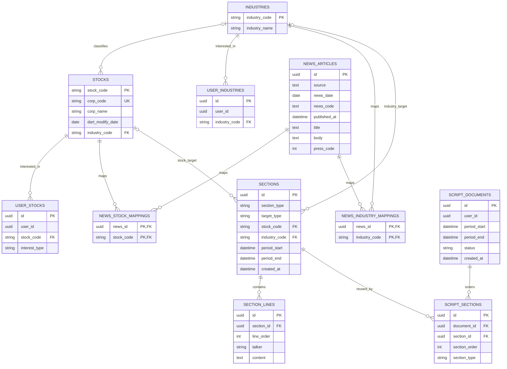

# 맞춤형 금융 스크립트 서비스

사용자의 관심 종목과 관심 업종에 연결된 뉴스 요약을 바탕으로 금융 오디오 브리핑을 생성합니다.

종목·업종 콘텐츠는 같은 기간을 요청한 여러 사용자가 공유합니다. 사용자별 오프닝, 브리지, 클로징은 별도로 생성하며, 최종 재생 순서는 사용자 문서에 저장합니다.

`tts-service`와 함께 저장소 루트의 통합 FastAPI 앱으로 실행됩니다.

## API

### 스크립트 생성

```http
POST /scripts/generate
Content-Type: application/json
```

요청 예시:

```json
{
  "start_at": "2026-07-22T00:00:00+09:00",
  "end_at": "2026-07-23T00:00:00+09:00",
  "user_ids": [
    "3ad697a8-8d7d-4f80-a66f-04d994a89611",
    "852471a5-f181-47f9-b526-079eef611ed8"
  ]
}
```

요청 규칙:

- `start_at`과 `end_at`에는 timezone이 있어야 합니다.
- `start_at`은 `end_at`보다 이전이어야 합니다.
- 뉴스 조회 범위는 시작 포함, 종료 미포함입니다.
- `user_ids`는 비어 있으면 안 됩니다.
- 중복 사용자 ID는 최초 입력 순서를 유지하며 제거됩니다.
- 현재 사용자 수 제한은 없습니다.

요청 필드:

| 필드 | 타입 | 필수 | 설명 |
|---|---|---|---|
| `start_at` | timezone을 포함한 ISO 8601 datetime | O | 뉴스 조회 시작 시각. 조회 범위에 포함 |
| `end_at` | timezone을 포함한 ISO 8601 datetime | O | 뉴스 조회 종료 시각. 조회 범위에 미포함 |
| `user_ids` | UUID 배열 | O | 생성 대상 사용자 ID. 빈 배열은 허용하지 않으며 중복은 제거 |

응답 예시:

```json
{
  "scripts": [
    {
      "script_id": "1ee14e43-fb5c-4225-8cb3-dc84a31e8423",
      "user_id": "3ad697a8-8d7d-4f80-a66f-04d994a89611",
      "reused": false
    }
  ],
  "failures": [
    {
      "user_id": "852471a5-f181-47f9-b526-079eef611ed8",
      "code": "NO_NEWS_FOUND",
      "message": "조회 기간에 관련 뉴스가 없습니다."
    }
  ]
}
```

전체 성공, 부분 성공, 사용자 단위 전체 실패는 `200 OK`를 반환합니다. 요청값 검증 실패는 `422 Unprocessable Entity`, 요청 전체를 처리할 수 없는 장애는 `500 Internal Server Error`를 반환합니다.

응답 필드:

| 필드 | 타입 | 설명 |
|---|---|---|
| `scripts` | 객체 배열 | 생성 또는 재사용에 성공한 사용자별 스크립트 |
| `scripts[].script_id` | UUID | `script_documents.id` |
| `scripts[].user_id` | UUID | 스크립트 소유 사용자 |
| `scripts[].reused` | boolean | 동일 사용자·기간의 완료 문서를 재사용했는지 여부 |
| `failures` | 객체 배열 | 생성하지 못한 사용자별 실패 결과 |
| `failures[].user_id` | UUID | 실패한 사용자 |
| `failures[].code` | string enum | 서비스 오류 코드 |
| `failures[].message` | string | 외부에 공개 가능한 실패 설명 |

HTTP 응답:

| 상태 | 조건 |
|---|---|
| `200 OK` | 전체 성공, 일부 사용자 성공 또는 모든 사용자의 사용자 단위 실패 |
| `422 Unprocessable Entity` | timezone 누락, 잘못된 기간, 빈 사용자 목록 등 요청 검증 실패 |
| `500 Internal Server Error` | 요청 전체를 처리할 수 없는 예상하지 못한 서버 장애 |

### 상태 확인

```http
GET /health
```

```json
{
  "status": "ok"
}
```

## 처리 흐름

1. 동일 사용자·기간의 기존 문서를 확인합니다.
2. `COMPLETED` 문서는 재사용하고 `GENERATING` 문서는 중복 생성하지 않습니다.
3. 생성 대상 사용자의 관심 종목과 업종을 일괄 조회합니다.
4. 종목·업종별 뉴스를 기간 조건으로 일괄 조회합니다.
5. 기존 공통 섹션을 재사용하고 없는 섹션만 OpenAI로 생성합니다.
6. 사용자별 오프닝, 브리지, 클로징을 한 번의 OpenAI 호출로 생성합니다.
7. 업종 코드 오름차순 후 종목 코드 오름차순으로 콘텐츠를 조립합니다.
8. 사용자별 DB 커밋이 완료된 결과만 성공으로 반환합니다.

## 오류 코드

| 코드 | 의미 |
|---|---|
| `USER_NOT_FOUND` | 사용자 정보를 찾을 수 없음. 현재 사용자 마스터 연동 전 예약 코드 |
| `NO_INTEREST_TARGET` | 관심 종목과 업종이 없음 |
| `NO_NEWS_FOUND` | 조회 기간에 관련 뉴스가 없음 |
| `AI_GENERATION_FAILED` | OpenAI 생성 요청 실패 |
| `AI_RESPONSE_INVALID` | 구조화 응답 검증 실패 |
| `DATABASE_ERROR` | 사용자 문서 저장 실패 |
| `GENERATION_TIMEOUT` | OpenAI 요청 시간 초과 |
| `GENERATION_IN_PROGRESS` | 같은 사용자·기간의 문서를 이미 생성 중 |

내부 SQL, API 키, OpenAI 응답 원문은 API 오류 응답에 포함하지 않습니다.

## 환경 설정

`script-service/.env.example`을 참고해 `.env` 파일을 준비합니다.

```env
DATABASE_URL=sqlite:///./kom_cast.db
OPENAI_API_KEY=your-openai-api-key
OPENAI_COMMON_MODEL=gpt-5.6-terra
OPENAI_COMMON_REASONING_EFFORT=medium
OPENAI_PERSONAL_MODEL=gpt-5.6-luna
OPENAI_PERSONAL_REASONING_EFFORT=none
OPENAI_CHECK_MODEL=gpt-5.6-luna
OPENAI_CHECK_REASONING_EFFORT=none
OPENAI_TIMEOUT_SECONDS=300
SCRIPT_AI_MAX_CONCURRENCY=5
```

| 환경변수 | 설명 |
|---|---|
| `DATABASE_URL` | SQLAlchemy DB 연결 주소 |
| `OPENAI_API_KEY` | OpenAI API 키 |
| `OPENAI_COMMON_MODEL` | 공통 섹션 생성 모델 |
| `OPENAI_COMMON_REASONING_EFFORT` | 공통 섹션 추론 수준 |
| `OPENAI_PERSONAL_MODEL` | 개인 섹션 생성 모델 |
| `OPENAI_PERSONAL_REASONING_EFFORT` | 개인 섹션 추론 수준 |
| `OPENAI_CHECK_MODEL` | OpenAI 연결 확인 스크립트 전용 모델 |
| `OPENAI_CHECK_REASONING_EFFORT` | OpenAI 연결 확인 스크립트 추론 수준 |
| `OPENAI_TIMEOUT_SECONDS` | OpenAI 요청 제한 시간. 기본 300초 |
| `SCRIPT_AI_MAX_CONCURRENCY` | 공통 섹션 동시 생성 수. 기본 5 |

`OPENAI_TIMEOUT_SECONDS`와 `SCRIPT_AI_MAX_CONCURRENCY`에는 0보다 큰 값을 입력해야 합니다.

## 개발 환경

Windows PowerShell:

```powershell
cd C:\path\to\kom-cast-ai\script-service
py -m venv .venv
.\.venv\Scripts\Activate.ps1
python -m pip install -r requirements.txt
```

macOS 또는 Linux:

```bash
cd /path/to/kom-cast-ai/script-service
python3 -m venv .venv
source .venv/bin/activate
python -m pip install -r requirements.txt
```

## 테스트

전체 테스트:

```powershell
.\.venv\Scripts\python.exe -m pytest -q
```

특정 테스트 파일:

```powershell
.\.venv\Scripts\python.exe -m pytest test\test_script_generation_integration.py -q
```

통합 테스트는 인메모리 SQLite를 사용하며 OpenAI 호출은 mock 처리합니다.

## 실제 OpenAI 연결 확인

```powershell
.\.venv\Scripts\python.exe -m scripts.check_openai_connection
```

이 명령은 실제 OpenAI API를 호출하므로 API 사용량과 비용이 발생합니다.
연결 확인 중에는 공통·개인 섹션 모두 `OPENAI_CHECK_MODEL`과
`OPENAI_CHECK_REASONING_EFFORT`를 사용합니다. 정상적으로 실행되면 관심 업종
1개와 관심 종목 2개로 구성된 맞춤형 브리핑이 출력됩니다.

## DB 전제조건

서비스는 다음 데이터를 기존 DB에서 조회한다고 가정합니다.

- 사용자별 관심 종목과 관심 업종
- 종목 및 업종 마스터
- 뉴스 요약과 종목·업종 매핑

`Base.metadata.create_all()`은 없는 테이블을 생성할 수 있지만 기존 테이블의 컬럼, 제약조건 또는 인덱스를 마이그레이션하지 않습니다. 운영 DB 변경은 별도 스키마 관리 절차로 수행해야 합니다.

### ERD



### 테이블 역할

| 테이블 | 역할 |
|---|---|
| `industries`, `stocks` | 업종·종목 마스터 |
| `user_industries`, `user_stocks` | 사용자별 관심 업종·종목 |
| `news_articles` | 생성 입력으로 사용하는 뉴스 원문과 요약 정보 |
| `news_industry_mappings`, `news_stock_mappings` | 뉴스와 업종·종목의 다대다 관계 |
| `sections` | 공통 콘텐츠 또는 사용자별 오프닝·브리지·클로징 |
| `section_lines` | 섹션에 포함된 코스·코미 발화와 발화 순서 |
| `script_documents` | 사용자와 조회 기간별 생성 문서 및 생성 상태 |
| `script_sections` | 문서에 포함된 섹션과 최종 재생 순서 |

`STOCK`, `INDUSTRY` 섹션은 대상과 기간이 같으면 여러 사용자 문서에서
재사용합니다. `OPENING`, `BRIDGE`, `CLOSING` 섹션은 사용자별로 생성하며
`script_sections.section_order`를 기준으로 공통 섹션과 함께 재생합니다.
