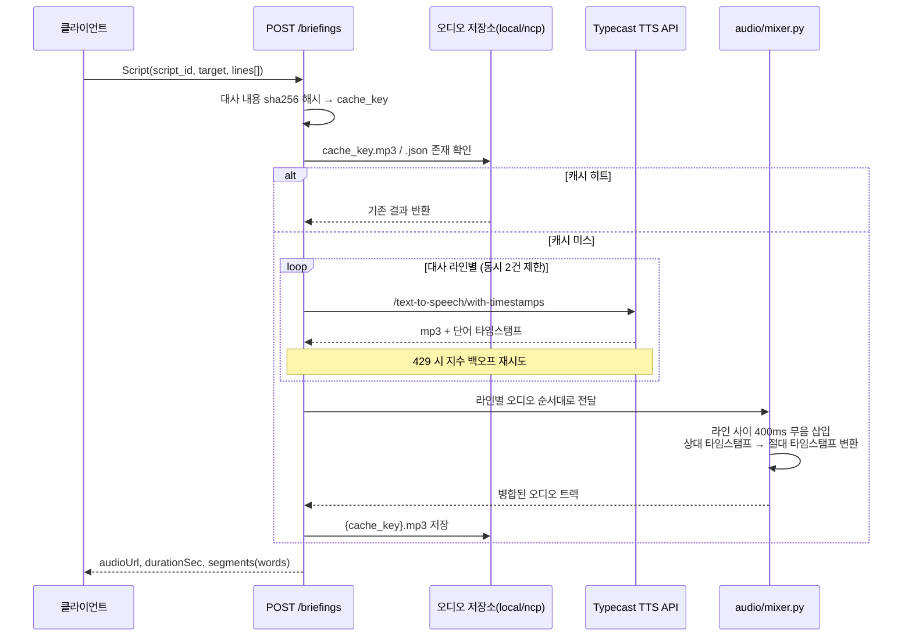

# tts-service

코스·코미 대화형 주식 브리핑 TTS 합성 서비스입니다. 스크립트(대사 리스트)를 받아 캐릭터별 목소리로 음성을 합성하고, 하나의 오디오 파일로 믹싱해 반환합니다.

> `script-service`와 함께 저장소 루트의 통합 FastAPI 앱(단일 프로세스, [`main.py`](../main.py))으로 묶여서 실행됩니다. 실행 방법은 [루트 README](../README.md)를 참고하세요. 이 문서는 tts 도메인 패키지(`tts_app`)의 구조와 단독 실행/테스트 방법을 다룹니다.

## 구조

```
tts-service/
├── tts_app/
│   ├── api/         # 라우터 (POST /briefings)
│   ├── audio/       # 합성된 라인들을 하나의 트랙으로 믹싱 + 오디오 저장소(local/ncp)
│   ├── script/      # 요청 스키마 (Script, DialogueLine)
│   ├── tts/          # Typecast API 연동 합성기
│   ├── characters.py # 화자(코스/코미) → 보이스 ID 매핑
│   ├── config.py     # 환경 변수 설정
│   └── main.py       # 단독 실행용 FastAPI 엔트리포인트
├── static/audio/     # AUDIO_BACKEND=local일 때 합성 결과 캐시(mp3/json) 저장 위치
└── tests/
```

## 합성 과정



## 요구 사항

- Python >= 3.11
- [ffmpeg](https://ffmpeg.org/) (pydub 오디오 처리에 필요)
- Typecast API 키

## 설치 및 실행

tts-service만 따로 띄워서 개발할 때는 이 디렉터리 안에서 독립적으로 실행할 수 있습니다(통합 앱으로 같이 실행하려면 [루트 README](../README.md) 참고).

```bash
python -m venv .venv
source .venv/bin/activate

pip install -r requirements-dev.txt  # 테스트 없이 실행만 할 경우 requirements.txt

cp .env.example .env
# .env 파일에 TYPECAST_API_KEY 값을 채워주세요

uvicorn tts_app.main:app --reload
```

서버가 뜨면 `GET /health` 로 상태 확인, `POST /briefings` 로 스크립트를 보내 브리핑 오디오를 생성할 수 있습니다.

## 오디오 저장소

`AUDIO_BACKEND` 환경변수로 오디오/매니페스트(JSON) 저장 위치를 고른다 (`tts_app/audio/storage.py`).

| 값 | 동작 | audioUrl |
|---|---|---|
| `local` (기본값) | `static/audio/{cache_key}.{mp3,json}` 디스크 저장 | `/static/audio/{cache_key}.mp3` |
| `ncp` | 네이버클라우드(금융) Object Storage(S3 호환)에 업로드 | `{AUDIO_CDN_BASE_URL}/{cache_key}.mp3` |

`ncp` 사용 시 아래 값을 채워야 하며, 하나라도 비어 있으면 서버 기동 시 에러가 납니다.

```bash
AUDIO_BACKEND=ncp
AUDIO_NCP_ENDPOINT_URL=https://kr.object.fin-ncloudstorage.com  # 기본값, 보통 안 바꿔도 됨
AUDIO_NCP_REGION=fin-standard                                    # 기본값
AUDIO_NCP_ACCESS_KEY=...
AUDIO_NCP_SECRET_KEY=...
AUDIO_NCP_BUCKET=...
AUDIO_CDN_BASE_URL=https://cdn.example.com   # 버킷을 origin으로 붙인 CDN 도메인
```

참고: [네이버클라우드 Object Storage(금융) 가이드](https://guide-fin.ncloud-docs.com/docs/storage-storage-8-2)

## 테스트

```bash
pytest
```

## API

### `POST /briefings`

요청 바디(`Script`): 스크립트 ID, 브리핑 대상(`target`), 화자별 대사 리스트.

`target`은 `type`(`STOCK` / `INDUSTRY` / `USER`)에 따라 모양이 달라지는 판별 유니온(discriminated union)입니다. 종목 브리핑은 `stock_id`, 산업군 브리핑은 `industry_id`를 함께 보내고, 사용자 지정 브리핑(`USER`)은 별도 id 없이 `type`만 보냅니다.

```json
{
  "script_id": "example",
  "target": { "type": "STOCK", "stock_id": 5930 },
  "lines": [
    { "speaker": "코스", "text": "오늘 삼성전자 주가는..." }
  ]
}
```

산업군 브리핑 예시:

```json
{
  "target": { "type": "INDUSTRY", "industry_id": 7 }
}
```

동일한 대사 내용이면 해시 기반 캐시 키로 재합성 없이 기존 결과를 반환합니다(캐시 키는 `lines` 내용만 기준으로 계산되며 `target`은 포함되지 않습니다). 응답에는 합성된 오디오 URL(`/static/audio/{key}.mp3`)과 세그먼트별 타이밍 정보가 포함됩니다.

응답 예시:

```json
{
  "audioUrl": "/static/audio/51bf0a84c902e809.mp3",
  "durationSec": 12.84,
  "segments": [
    {
      "speaker": "코스",
      "text": "오늘 삼성전자 주가는 2% 상승했습니다.",
      "startSec": 0.0,
      "words": [
        { "text": "오늘", "startSec": 0.0, "endSec": 0.32 },
        { "text": "삼성전자", "startSec": 0.32, "endSec": 0.81 },
        { "text": "주가는", "startSec": 0.81, "endSec": 1.15 }
      ]
    },
    {
      "speaker": "코미",
      "text": "네, 외국인 매수세가 강했네요.",
      "startSec": 6.1,
      "words": [
        { "text": "네,", "startSec": 6.1, "endSec": 6.3 },
        { "text": "외국인", "startSec": 6.3, "endSec": 6.7 }
      ]
    }
  ]
}
```

## 배포 전 TODO 체크리스트

- [ ] 통합 앱 엔트리포인트([`main.py`](../main.py))의 CORS `allow_origins`를 로컬 Vite 개발 서버(`localhost:5173`) 대신 실제 프론트엔드 배포 도메인으로 교체
- [x] 오디오 저장소를 로컬 디스크(`static/audio`)에서 오브젝트 스토리지 + CDN으로 교체 가능하도록 `AUDIO_BACKEND` 스위치 추가(`tts_app/audio/storage.py`). 배포 시 `AUDIO_BACKEND=ncp` 및 관련 환경변수 설정 필요
- [ ] `TYPECAST_API_KEY` 등 시크릿을 `.env` 파일 대신 배포 환경의 시크릿 매니저(예: AWS Secrets Manager, Vault)로 관리
- [ ] 실행 커맨드에서 `--reload` 제거하고, 워커 수를 지정한 프로덕션 ASGI 실행(uvicorn workers 또는 gunicorn) 구성
- [ ] `/briefings` 엔드포인트에 인증/인가 및 요청 제한(rate limit) 추가
- [ ] 로깅 및 모니터링(에러 트래킹, 헬스체크 연동) 구성
